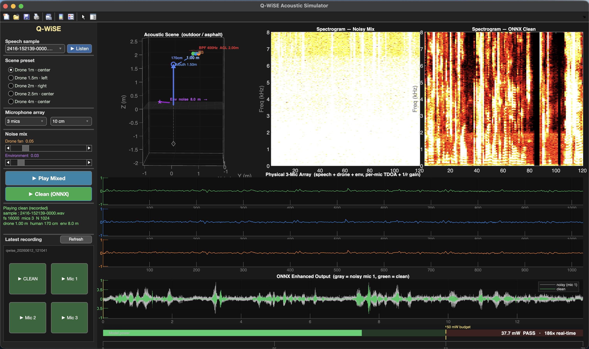

# [Q-WiSE](https://sensifai.com/en/portfolio/qwise) - Quantized AI-Powered Deep Wiener-Filter Speech Enhancement for Ultra-Low-Power Edge

Q-WiSE yields ultra-low-power, privacy-preserving speech enhancement ONNX with below 50 mW energy consumption,
deployable on micro-edge platforms such as STM32, ESP32, and Nordic nRF53.



## Requirements

Install dependencies:

```bash
pip install -r requirements.txt
```

---

## Model Input / Output

The ONNX model accepts a **raw multi-channel microphone array** and returns a single enhanced (denoised) mono channel.

| Tensor   | Shape    | dtype     | Description                                |
|----------|----------|-----------|--------------------------------------------|
| `input`  | `[C, T]` | `float32` | C microphone channels, T samples at 16 kHz |
| `output` | `[1, T]` | `float32` | Enhanced single-channel speech             |

- **Sample rate:** 16 000 Hz (hard requirement — resample if needed)  
- **Channels:** 3 (mic0, mic1, mic2); channel order must follow physical array layout  
- **Amplitude:** samples must be in the range `[-1.0, 1.0]` (normalise before passing)

---

## Passing Microphone Signals

### From WAV files

```python
import soundfile as sf
import numpy as np

# load each mic channel separately
mic0, sr = sf.read("mic0.wav")   # shape: (T,)
mic1, _  = sf.read("mic1.wav")
mic2, _  = sf.read("mic2.wav")

assert sr == 16000, "model expects 16 kHz audio"

# stack into [C, T] float32
mic_array = np.stack([mic0, mic1, mic2], axis=0).astype(np.float32)
```

### From a live microphone (streaming)

```python
import sounddevice as sd
import numpy as np

SAMPLE_RATE = 16_000
CHANNELS    = 3
DURATION    = 5   # seconds

recording = sd.rec(
    int(DURATION * SAMPLE_RATE),
    samplerate=SAMPLE_RATE,
    channels=CHANNELS,
    dtype="float32",
)
sd.wait()

# recording shape: (T, C) → transpose to (C, T)
mic_array = recording.T   # shape: [3, T]
```

---

## Running Inference

```python
import onnxruntime as ort

session = ort.InferenceSession("qwise.onnx", providers=["CPUExecutionProvider"])

# mic_array: np.ndarray, shape [3, T], float32
enhanced = session.run(
    ["output"],
    {"input": mic_array[np.newaxis]}   # add batch dim → [1, 3, T]
)[0]                                   # returns [1, 1, T]

clean = enhanced[0, 0]   # shape: (T,)
```

Save the result:

```python
import soundfile as sf

sf.write("clean.wav", clean, samplerate=16_000, subtype="PCM_16")
```

---

## `run_demo.py` — CLI Test Script

`run_demo.py` is the reference test runner. It accepts multiple WAV files (one per channel), runs inference, saves the enhanced output, and optionally reports energy metrics.

### Synopsis

```
python run_demo.py <mic0.wav> [mic1.wav mic2.wav ...] [options]
```

### Options

| Flag                 | Description                                     |
|----------------------|-------------------------------------------------|
| `-o / --output PATH` | Output WAV path (default: `output/clean.wav`)   |
| `--energy`           | Print the energy meter report after inference   |
| `--realtime`         | Assert RTF < 1.0 and show real-time factor      |
| `--model PATH`       | Path to ONNX model file (default: `qwise.onnx`) |

### Examples

**Basic enhancement — 3-mic array:**

```bash
python run_demo.py examples/example3/mic0.wav \
              examples/example3/mic1.wav \
              examples/example3/mic2.wav \
              -o output/example3/clean.wav
```

**With energy report and real-time check:**

```bash
python run_demo.py examples/example3/mic0*.wav \
              -o output/example3/clean.wav \
              --energy --realtime
```

**Custom model path:**

```bash
python run_demo.py examples/example1/mic0*.wav \
              -o output/example1/clean.wav \
              --model checkpoints/qwise_q8.onnx \
              --energy
```

### Output files

After a successful run the script writes:

```
output/example3/clean.wav              # enhanced mono audio
output/example3/clean_waveform.png     # time-domain waveform comparison
output/example3/clean_spectrogram.png  # log-mel spectrogram
```

---

## Energy Meter

When `--energy` is passed the script prints a power report calibrated against a **50 mW edge budget**:

```
--- energy meter ---------------------------------------------
audio/infer  : 29.8 s
latency      : 153.6 ms     RTF 0.0052  (194x real-time)
model power  : 36.1 mW   (RTF x 7 W board = UPPER BOUND)
meter        : [###################-------] 36.1 / 50 mW   PASS
--------------------------------------------------------------
```

| Field         | Meaning                                                             |
|---------------|---------------------------------------------------------------------|
| `audio/infer` | Total audio duration processed                                      |
| `latency`     | Wall-clock inference time for the full clip                         |
| `RTF`         | Real-Time Factor — `latency / audio_duration` (lower is better)     |
| `model power` | Estimated power = `RTF × 7 W` (conservative board TDP upper bound)  |
| `meter`       | Visual gauge against the 50 mW budget; **PASS** means within budget |

> **Note:** Power is an *upper bound* estimate computed from RTF and assumes a 7 W board TDP. No hardware power telemetry is used on a development host. On a real edge target (e.g. STM32 MP1) attach an INA219 or equivalent to obtain measured draw.

### Interpreting RTF

RTF < 1.0 means the model processes audio **faster than real-time**. An RTF of 0.005 means 1 second of audio is enhanced in ~5 ms — roughly **200× real-time** — leaving substantial headroom for other on-device tasks.

## Acknowledgements

The Q-WiSE project has received funding through the dAIEDGE Exchange Programmes Open Call 3 with agreement number dAI3OC09. 
The project was implemented by Sensifai BV as beneficiary and funded as part of the dAIEDGE project under Horizon Europe / European Union funding with grant number 101120726.